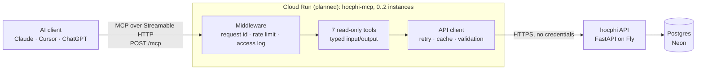
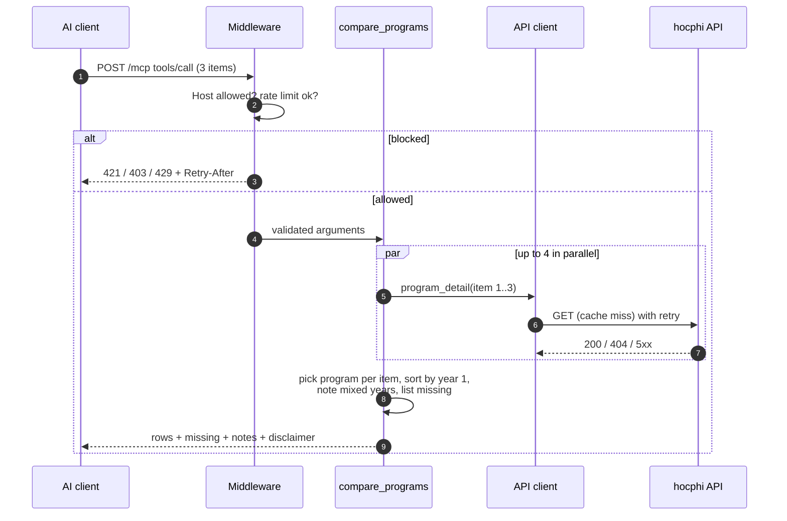
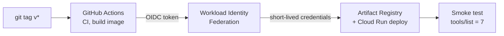

# hocphi-info-mcp — design

A short design note (one read, ~10 minutes). It records what the system is for, how it is
built, why the main choices were made, and where it will break. Status of each part is marked
**built** or **planned** so the document stays honest.

## 1. Problem and scope

People increasingly ask AI assistants "how much is tuition for major X at school Y?". An
assistant without a source guesses. [hocphi.info](https://hocphi.info) has curated, sourced
tuition data for Vietnamese universities, but only behind a website.

**Goal:** let any MCP-capable assistant query that data and answer with the *same numbers as
the website*, plus academic year and source URL.

**Non-goals:** writes, user accounts, personalization, calling an LLM (the client's model does
that), replacing the website, or being authoritative — figures are reference values collected
from schools' public announcements.

**Constraints that shaped the design:** public and unauthenticated; must stay inside cloud free
tiers (~$0/month); solo maintainer; data set is small (≈230 program rows, 15 schools, growing).

## 2. Architecture (built)

The MCP server is a **thin, stateless client of the public REST API**. It never touches the
database and contains no tuition rules; the backend computes every figure and this service
fetches, validates, caches and presents them with their sources.

## 3. Key decisions and trade-offs

| Decision | Why | Cost / what we gave up |
|---|---|---|
| **Call the REST API, not the database** | Numbers on the website and in the assistant can never diverge (one implementation of "year-1", "course total", "ranges"); no DB credentials or network path to expose. | One extra hop (~100–300 ms measured to the Fly origin) and a dependency on the backend being up — mitigated by retries and a cache. |
| **Stateless Streamable HTTP** (`stateless_http`) | Any instance can serve any request → no sticky sessions, scale-to-zero friendly. The 2026-07-28 protocol is sessionless anyway; this makes older clients behave the same way. | No server→client channel (we don't need one). |
| **Seven small, typed tools** (Pydantic in/out → JSON schema) | Few tools keep tool selection reliable; typed output lets clients validate and models read consistent fields. Each amount is given in VND *and* millions to avoid unit mistakes. | `tools/list` is ~35 KB (mostly output schemas). |
| **Tools present, never re-derive** | A second copy of a rule drifts. The only derived value is the implied yearly increase, read off the backend's own year-1/year-2 ratio and labelled as a default estimate. | Cannot offer "what if" inputs (custom years/rates) in v1. |
| **Errors written for the model** (`ToolFailure`) | `not_found: … use search_majors` lets the assistant recover; internal paths never leak. Partial failures in `compare_programs` don't sink the comparison. | A bit more code than raising raw exceptions. |
| **Call the Fly origin, not `api.hocphi.info`** | The public hostname sits behind Cloudflare, which returns 403 to some User-Agents (verified with `curl -A`), and datacenter IPs might be challenged. Server-to-server traffic doesn't need that layer. | Bypasses Cloudflare's DDoS/cache for this path — fine at this volume; the client also sends an explicit `User-Agent`. |
| **In-memory per-client rate limit + `--max-instances`** | Free, no shared store, simple to reason about. Cloud Armor needs a load balancer (~$18/month); Redis/Memorystore costs money. | Each instance counts separately → real limit is `instances × limit`. The instance cap is the hard ceiling. |
| **TTL cache with single-flight in memory** | The two big lists rarely change (only when data is seeded); single-flight prevents a stampede when an entry expires. | Cache is lost when the instance scales to zero; up to 10 minutes stale after a data update. |
| **Generated API models + drift CI** | The backend's `openapi.json` is the contract; the client models are generated and CI (plus a daily cron) fails when they drift. | One more generated file to keep in sync. |
| **No secrets at runtime** | The backend is public, so there is nothing to protect; deployment is keyless (see §7). | If the backend ever needs a token, Secret Manager gets its first real use. |

## 4. Life of one request (built)

Error handling per layer: transport errors are plain HTTP status codes; the API client turns
403/408/429/5xx and network errors into up to 3 attempts (0.3 s, 0.6 s backoff) and then
`Unavailable`; 404 is `NotFound` immediately; the tool layer maps those to `ToolFailure`
(`is_error=true` with a helpful message) or, in `compare_programs`, to a `missing` entry.

## 5. Data and contract (built)

The backend publishes `openapi.json`; `datamodel-codegen` (version pinned) generates
`api_models.py`, used only to *parse* backend responses (unknown fields ignored, missing required
fields fail loudly). Tool output models are hand-written and separate, so the assistant sees a
small, stable, well-described shape. CI regenerates the models from the backend's `main` and
fails on any diff, and runs daily, so a backend change is noticed even when this repo is idle.

## 6. Failure modes

| Failure | Effect | Handling |
|---|---|---|
| Backend down or slow | Tools error with `upstream_unavailable` (retryable) | Timeout 12 s × up to 3 attempts; cached lists still served while fresh. |
| Fly machine resuming | Transient 403/5xx for ~1 s | Retried like the website's own client. |
| Cloudflare blocks a client | 403 on `api.hocphi.info` | Default is the Fly origin; explicit `User-Agent`; smoke test after deploy catches it. |
| Backend adds/changes a field | Parsing could break | `extra=ignore` for additions; CI/cron regenerates models and fails on real drift. |
| Data missing (school not crawled) | Assistant might guess | `not_found` with hints, `instructions` tell the model not to use figures from memory. |
| Abuse / traffic spike | Cost or backend load | Rate limit, 64 KB body cap, `max-instances`, backend cache; budget alert (planned). |
| Instance restarts | Cache and rate-limit counters reset | Acceptable; nothing durable lives here. |

## 7. Delivery and operations

Built: multi-stage `Dockerfile` (uv build stage → slim runtime, non-root, ~46 MB virtualenv,
`SIGTERM` shutdown in <1 s), CI (ruff, mypy, generated-model drift, tests, image smoke test).

Planned (U7–U8): GitHub Actions → **Workload Identity Federation** (OIDC, no service-account
key anywhere) → Artifact Registry → Cloud Run in `asia-southeast1`, `min 0 / max 2`,
`--allow-unauthenticated`, then a post-deploy smoke test and a daily comparison of one tool
figure against the REST API. A Cloud Billing budget alert is a warning only; the real cost
ceiling is `max-instances` plus the rate limit.

**Observability (built):** one JSON line per log record on stdout (`severity`, `message`,
`request_id`, optional Cloud Trace field). A `request` line per request (hashed client, never the
raw IP) and a `tool_call` line per tool call (tool, duration, result count, error code).

## 8. Capacity and cost

Measured on a laptop against the real backend: a tool call takes ~0.15–0.6 s (dominated by the
backend round trip); the backend answers in ~90–290 ms; the image starts and stops in well under
a second. Rough budget for **20,000 tool calls a month** at ~0.8 s each on 1 vCPU / 512 MiB:
≈16,000 vCPU-s, ≈8,000 GiB-s, 20,000 requests, against Cloud Run's free 180,000 vCPU-s,
360,000 GiB-s and 2 M requests (the free tier is a Tier-1-priced credit, so a Tier-2 region such
as Singapore gets somewhat fewer units — still a large margin). Artifact Registry (0.5 GiB free)
holds ~3 images; logging volume is far below the 50 GiB free allowance.

## 9. Security model

Public and read-only. No credentials exist in the service. Inputs are validated by schema and
again in the client (slug/code regexes, length caps) before any request; the client only ever
calls one configured base URL, so user input cannot redirect it (no SSRF). `Host` allow-list
against DNS rebinding; browser `Origin`s refused. Rate limit keyed on the address the trusted
proxy appended to `X-Forwarded-For` (client-supplied parts are ignored). Logs contain no raw IPs.
CI/CD is keyless (planned).

## 10. If it grew 100×

- Move rate limiting to a shared store or the edge (Cloud Armor / API gateway) for exact limits and per-key quotas.
- Put a CDN/cache in front of the API for the read-heavy lists; use `ETag`s so the MCP cache revalidates cheaply.
- Keep the backend's read path on a replica; consider a read-optimized snapshot of the two big lists.
- Multi-region Cloud Run behind one hostname; per-region caches are fine because data is read-only and eventually consistent.
- Add per-client identification (API keys) only if abuse appears — it costs usability for a free public dataset.

## 11. Talking points (for interviews)

- *Why REST instead of the DB?* Single source of truth for the numbers, no exposed DB, and the contract is testable (generated models + drift CI).
- *Why stateless?* Scale-to-zero and any-instance-any-request; the newer protocol is sessionless anyway.
- *What's the weakest part?* The rate limit is per instance; the instance cap is what actually bounds cost. I chose that over paying for a load balancer.
- *How do you know the assistant shows correct numbers?* Tests assert tool output equals the backend's numbers on saved real responses; a scheduled smoke test compares one live figure.
- *What did testing catch?* A falsy-object bug (`limiter or default` discarded an empty limiter because it defined `__len__`), and a Cloudflare User-Agent block found while investigating the network path.
